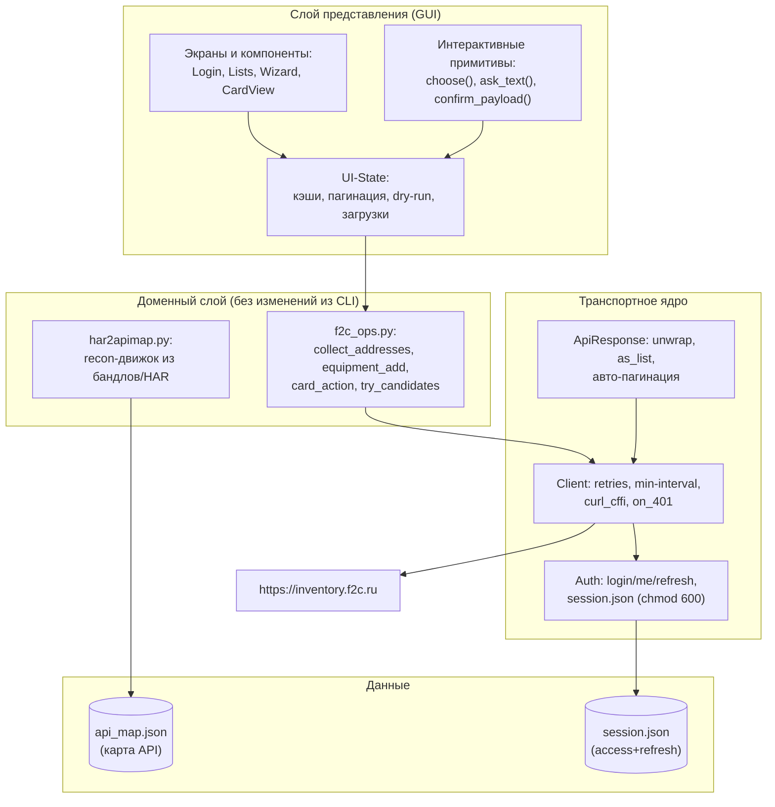
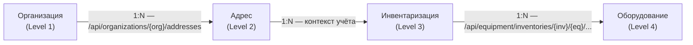
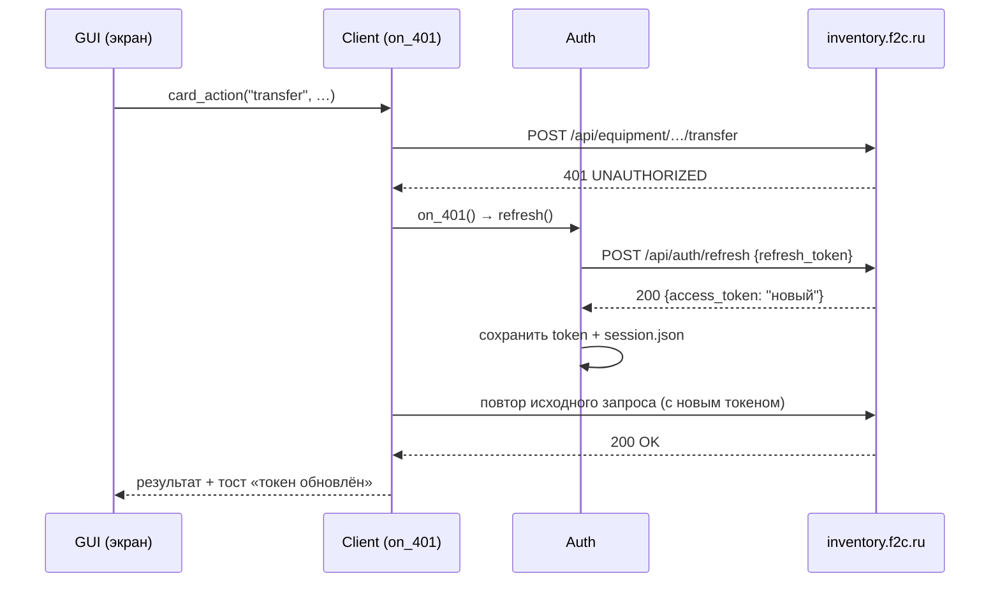
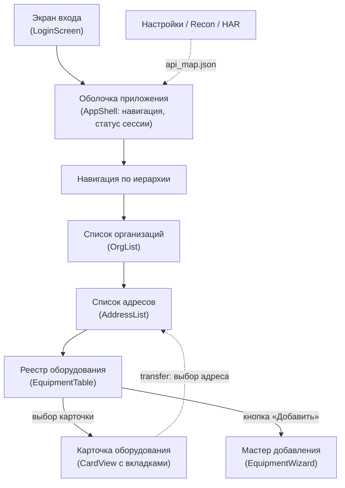
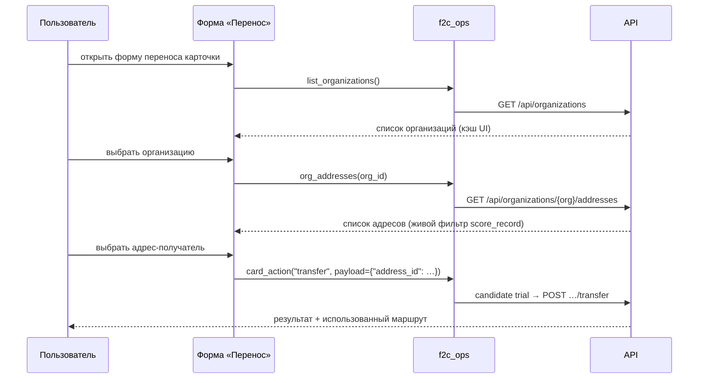

# Архитектура и логика графического интерфейса (GUI) системы F2C

> Документ описывает, как устроен и как работает графический интерфейс для
> личного кабинета учёта оборудования [inventory.f2c.ru](https://inventory.f2c.ru).
> Все механизмы, описанные здесь, уже реализованы и проверены в ядре
> (`f2c_inventory.py`, `f2c_ops.py`, `interactive.py`, `har2apimap.py`) —
> GUI является тонкой «витриной» над этим ядром и повторяет его логику 1:1.

---

## 0. Слоистая архитектура

GUI строится по трёхслойной схеме: **представление → домен → транспорт**.
Графический слой ничего не знает об HTTP и эндпоинтах — он вызывает те же
доменные функции, что и CLI, поэтому логика не дублируется.



| Слой | Файлы/функции | Ответственность |
|---|---|---|
| Представление | экраны GUI + `interactive.py` | отрисовка, пользовательский ввод, диалоги |
| Домен | `f2c_ops.py` | правила предметной области: организации → адреса → инвентаризации → оборудование; выбор эндпоинтов-кандидатов |
| Транспорт | `f2c_inventory.py` (`Client`, `Auth`, `ApiResponse`) | HTTP, сессии, ретраи, троттлинг, авто-refresh токена |
| Данные | `~/.config/f2c-inventory/` | карта API и защищённая сессия |

---

## 1. Архитектурная структура данных

Данные строго следуют иерархии F2C — четыре уровня вложенности. GUI строит
навигацию по той же схеме: каждый уровень — источник данных для следующего.



| Уровень | Сущность | Источник данных (маршруты из реальной карты API) | Поля GUI |
|---|---|---|---|
| L1 | Организация | `GET /api/organizations` | ID, название |
| L2 | Адрес | `GET /api/organizations/{org}/addresses` | ID, полный адрес, город/улица/дом, организация |
| L3 | Инвентаризация | `GET /api/inventories` (кампании учёта) | ID, название, статус (active/completed) |
| L4 | Оборудование | `GET /api/equipment` (+ фильтры `address_id`, `inventory_id`) | ID, модель, серийный №, инв. №, статус, фото |

Детальные и экшн-маршруты L4 (из карты API пользователя):

```
GET    /api/equipment/{id}
PUT    /api/equipment/{id}
POST   /api/equipment/inventories/{inv}/{eq}/found|unfound|transfer|review
GET/POST /api/equipment/{id}/photos
POST   /api/equipment/serial-lookup/manual   (поиск по серийному номеру)
POST   /api/equipment/serial-lookup/photo    (распознавание по фото)
GET    /api/equipment/{id}/history  ·  /api/journals/meta
```

**Правило GUI:** ни один экран не строит URL сам. Пути приходят только из
`api_map.json`, а действия исполняются через доменный слой (см. §2.3), который
сам выберет рабочий маршрут из кандидатов.

---

## 2. Логика авторизации и взаимодействия с API

Публичной документации API нет, поэтому GUI обязан быть «умным»: работать с
картой эндпоинтов, перебирать кандидатов и самовосстанавливать сессию.

### 2.1. Управление сессией (Session Management)

Хранение — в `session.json` (`~/.config/f2c-inventory/`) с правами **0600**
(реализовано в `config_dir()`/`ensure_private()`). Структура сессии:

```json
{
  "base_url": "https://inventory.f2c.ru",
  "email": "user@f2c.ru",
  "login_endpoint": "/api/auth/login",
  "token_path": "data.access_token",
  "token": "…access…",
  "refresh_token": "…refresh…",
  "auth_header_template": "Authorization: Bearer {token}"
}
```

- **Вход** (`Auth.login`): эндпоинт берётся из карты API (явный
  `login_endpoint` → пути с `login`/`signin` → дефолты), тело `{email,
  password}`. Маршруты-«пустышки» (HTML-ответ SPA, 404/NOT_FOUND)
  пропускаются; первый существующий маршрут считается точкой входа.
  Токен ищется рекурсивно в любом поле ответа (приоритет:
  `access_token` → `token` → `refresh_token` → …).
- **Автообновление при 401**: `Client` при ответе 401/403 вызывает
  колбэк `on_401` → `Auth.refresh()` → `POST /api/auth/refresh
  {"refresh_token": …}` → новый токен подставляется в `Client.token` и в
  `session.json`, **исходный запрос повторяется**. Обновление защищено
  флагом `_auth_retrying` (single-flight: параллельные 401 не порождают
  нескольких refresh-запросов).



### 2.2. Движок разведки API (Recon Engine)

GUI использует карту `api_map.json`, которая строится двумя способами
(`Recon.run` / `Recon.run_from_har`):

1. **Из JS-бандлов** (`recon`): страница входа → `<script src>` →
   статические бандлы → извлечение строковых литералов путей → определение
   метода по контексту вызова (`axios.get(`, `fetch(`, `method: "POST"`).
2. **Из HAR-лога** (`recon --har`): реальный трафик браузера → точные
   методы, эндпоинт входа, поле токена, заголовок авторизации, пагинация.

GUI-интерпретация карты:

- в карте часть путей имеет метод `?` (в бандле метод не виден) — для таких
  маршрутов GUI применяет умолчания из `ACTION_METHODS`
  (`transfer→POST`, `found→POST`, `curator→PUT`, …);
- пути из бандла относительны к базе `/api`: `/equipment` ⇒
  `/api/equipment` (логика `_expand()`);
- при старте GUI проверяет наличие `api_map.json`; если карты нет или она
  устарела — предлагает экран «Разведка API» (загрузка бандлов или импорт
  HAR-файла) до входа в рабочие разделы.

### 2.3. Перебор кандидатов (Candidate Trial)

Любое доменное действие (transfer, found, photo-add, …) не знает точный
эндпоинт заранее. Общий алгоритм — `try_candidates()`:

```text
ВХОД:  действие, id карточки, (необязательно) inventory_id, payload
1. собрать кандидатов:
   а) шаблоны из api_map.json по регулярному паттерну действия
      (например /equipment/inventories/${e}/${t}/transfer),
      с подстановкой параметров ({e}→inventory_id, {t}→card_id);
   б) типовые REST-пути (/api/equipment/{id}/transfer, …);
   в) ручные переопределения пользователя (--path/--method);
   г) для multipart-загрузок — варианты с префиксом /api и без.
2. упорядочить: карта API → типовые пути → дефолты, без дублей;
3. для каждого кандидата:
   POST/GET → если ответ это HTML (SPA-фолбэк), 404/405/501 или
   error.code == NOT_FOUND → пропустить; иначе → ВЫБРАТЬ кандидата;
4. если все кандидаты исчерпаны → показать понятную ошибку
   «Не удалось найти рабочий эндпоинт…» + предложить recon --har.
```

Требование к GUI: **результат перебора прозрачен** — тост показывает
фактически использованный маршрут («выполнено через
`/api/equipment/inventories/7/500/transfer`»), чтобы пользователь при
необходимости мог зафиксировать его в `--path` или отправить разработчику.

---

## 3. Структура графических модулей



### А. Модуль навигации и списков (Lists)

| Компонент | Логика из ядра | Детали GUI |
|---|---|---|
| **Фильтр организаций** | `score_record()` | выпадающий поиск с живым фильтром: результаты ранжируются по вхождению запроса (полное вхождение > слова > префиксы), топ-N |
| **Список адресов** | `collect_addresses()` + `addr_display()` | таблица «ID · Адрес · Организация»; данные собираются обходом всех организаций с параллельными (с ограничением) запросами `org_addresses()`; строки форматируются `addr_display()` |
| **Реестр оборудования** | `equipment_rows()` + `fetch_all_pages()` | динамическая таблица с бесконечной прокруткой/постраничной навигацией; колонки: Модель, Серийный №, Инв. №, Статус; фильтры `address_id`/`inventory_id` |

Требования к реализации списков:

- виртуализация строк (большие реестры не должны тормозить UI);
- пагинация — через ядро `fetch_all_pages()` (оно само определяет ключ
  списка `data.items` и общее количество `total`);
- при клике на строку оборудования открывается `CardView`, при клике на
  адрес — его карточка с вкладкой «Оборудование на адресе».

### Б. Формы и мастера (Wizards)

**Мастер добавления оборудования** — графический эквивалент `_wizard_add()`:

| Шаг | Поле | Валидация |
|---|---|---|
| 1 | Организация | выбор обязателен |
| 2 | Адрес (зависимый список) | список грузится лениво по выбранной организации |
| 3 | Название/модель | **обязательное** |
| 4 | Серийный №, Инв. №, Количество, Комментарий | опционально (числа парсятся `smart_value()`) |
| 5 | Предпросмотр JSON | переключатель dry-run; кнопка «Отправить» |

**Форма редактирования карточки**:

1. при открытии подгружает текущие значения через `card_show()`
   (детальный GET, кандидаты `equipment_detail_candidates()`);
2. пользователь меняет поля, изменившиеся значения отправляются
   `PUT` (фолбэк `PATCH`) — только изменённые ключи, а не весь объект;
3. `dry-run` показывает итоговый JSON до отправки.

### В. Модуль управления карточкой (Card View)

Детальное окно карточки — вкладки, зеркально соответствующие `MENU_ITEMS`:

| Вкладка | Действия | Доменная функция |
|---|---|---|
| **Обзор** | поля карточки, статус | `card_show()` |
| **Действия** | «Найдено» / «Не найдено» (с выбором `inventory_id` из `GET /api/inventories`), «Осмотр» (`review` + комментарий), «Перенос» (выбор адреса-получателя), «Редактировать» | `card_action(..., "found"/"unfound"/"review"/"transfer")` |
| **Фото** | галерея списка фото; форма `photo-add` (multipart/form-data, поле `photo`), drag&drop | `_photo_endpoint()` |
| **Поиск** | два режима: ручной ввод серийника (`serial-lookup/manual`) и загрузка фото для распознавания (`serial-lookup/photo`) | `card_action(..., "serial")`, `"serial-photo"` |
| **История** | журнал изменений карточки; фолбэк — общий журнал `/api/journals/meta` | `HISTORY_PAT`-кандидаты |
| **Опасная зона** | удаление карточки с двойным подтверждением | `card_action(..., "delete")` |

Каждая вкладка загружается лениво (данные запрашиваются при первом
открытии вкладки, а не при открытии карточки).

---

## 4. Логика загрузки данных для форм (lazy loading)

Правило: **данные запрашиваются ровно тогда, когда они нужны, и ровно в том
объёме, который нужен**. Никаких массовых предзагрузок при старте.

### 4.1. Каскадная загрузка контекста (форма переноса)



Списки организаций и адресов кэшируются в состоянии UI (TTL-инвалидация,
ручная кнопка «Обновить»), чтобы повторные открытия форм не порождали
лишние запросы.

### 4.2. Поиск по серийному номеру (два режима)

- **Ручной** (`serial-lookup/manual`): поле ввода → `{"serial": "…"}` →
  результат — карточка(-и) с быстрым переходом в CardView.
- **По фото** (`serial-lookup/photo`): выбор/перетаскивание изображения →
  `multipart/form-data` (поле `photo`) → ответ с распознанным номером и
  confidence → предложение открыть найденную карточку.

### 4.3. Переключатель dry-run (безопасность действий)

Любое мутирующее действие (создание, правка, transfer, found/unfound,
удаление) имеет глобальный переключатель **Dry-run** в статус-баре и
локальный в каждой форме. В режиме dry-run:

- запрос **не отправляется**;
- показывается полный предпросмотр: `METHOD` + фактический путь-кандидат +
  итоговый JSON тела (и список файлов для multipart);
- для удаления/переноса — явное подтверждение (диалог, не просто тост).

---

## 5. Технические требования к реализации

### 5.1. Обработка ошибок

- Глобальный перехватчик `ApiError` (`{code, message, status, url}`):
  - `NOT_FOUND` → «Эндпоинт не найден — обновите карту API (recon --har)»;
  - `UNAUTHORIZED` → автоматический refresh (§2.1); при неудаче — экран
    повторного входа;
  - `HTTP_429` → тост «Сервер просит паузу» + автоматический ретрай с
    экспоненциальной задержкой (уже в `Client.request`);
  - сетевые ошибки → ретраи (3 попытки) и баннер о недоступности сети.
- Все уведомления пользователю — на русском, с кнопкой «Подробнее»
  (полный ответ сервера в свернутом блоке).

### 5.2. Защита данных

- токены/пароли **никогда** не пишутся в логи GUI (маскирование
  `mask_value()` — первые/последние 3 символа);
- сессия хранится в файле с правами 0600 (наследуется из ядра);
- HAR-импорт маскирует чувствительные поля перед сохранением
  `api_map.json` (уже реализовано в `har2apimap.py`);
- кнопка «Забыть сессию» (logout) стирает `session.json`.

### 5.3. Оптимизация и вежливость к серверу

- параметр **min-interval** (настройка GUI): минимальная пауза между
  запросами; по умолчанию 0, рекомендуемое значение 0.2–0.5 с;
- параллельные запросы ограничены пулом (например, сбор адресов по
  организациям — не более 3 одновременных);
- повторные 429/5xx не бомбардируют сервер (ретраи уже в ядре);
- при недоступности эндпоинта результат негативного candidate trial
  кэшируется на сессию (не перебирать 10 кандидатов на каждый клик).

---

## 6. Рекомендуемый стек и структура GUI-проекта

Ядро (f2c_ops/f2c_inventory) — чистый Python без зависимостей от
интерфейса, поэтому GUI может быть любым:

| Вариант | Плюсы | Минусы |
|---|---|---|
| **Web (FastAPI/Flask + htmx или Alpine.js)** — рекомендуемый | единая логика на Python; доступ с любого устройства; легко демонстрировать | нужен сервер |
| **TUI (Textual)** | максимальное переиспользование `interactive.py`; быстро | только терминал |
| **Desktop (PySide6)** | нативно, офлайн | больше кода, сложнее распространять |

Предлагаемая структура (web-вариант, все вызовы — только через доменный слой):

```
gui/
├── app.py                 # FastAPI-приложение, монтирование маршрутов
├── state.py               # сессия UI: кэши организаций/адресов, dry-run, min-interval
├── routes/
│   ├── auth.py            # /login /logout /status
│   ├── lists.py           # organizations, addresses, equipment (JSON API)
│   └── card.py            # show/edit/transfer/found/unfound/review/photos/…
├── templates/             # htmx-шаблоны экранов и вкладок
├── static/                # галерея, drag&drop фото, тосты
└── tests/
    ├── test_gui_flows.py  # e2e-сценарии через TestClient против мок-сервера
    └── test_domain.py     # юнит-тесты try_candidates, score_record, refresh
```

Маршруты GUI — это тонкие адаптеры: `lists.py → f2c_ops.collect_addresses()`,
`card.py → f2c_ops.card_action()` и т.д. Вся «умная» логика остаётся в
существующих файлах.

---

## 7. Соответствие «GUI-компонент → функция ядра»

| Требование из ТЗ | GUI-компонент | Реализация в коде |
|---|---|---|
| Иерархия L1–L4 | навигация-дерево | маршруты `/api/organizations`, `…/addresses`, `/api/inventories`, `/api/equipment` |
| Session + refresh на 401 | статус-бар, экран входа | `Auth.refresh()`, `Client.on_401` |
| Recon Engine | экран «Разведка API» | `Recon.run`, `Recon.run_from_har` |
| Candidate Trial | прозрачный тост маршрута | `try_candidates()`, `card_action()` |
| Живой фильтр и ранжирование | поиск организаций/адресов | `score_record()` |
| Списки с пагинацией | таблицы + бесконечная прокрутка | `fetch_all_pages()` |
| Мастер добавления | пошаговая форма | `_wizard_add()` |
| Вкладки карточки | CardView | `MENU_ITEMS` → `dispatch_card()` |
| Ленивая загрузка | формы transfer/serial | `list_organizations()` → `org_addresses()` |
| dry-run | переключатель в статус-баре | флаг `dry_run` во всех доменных командах |
| Защита данных | маскирование логов, 0600 | `mask_value()`, `ensure_private()` |
| min-interval | настройка | `Client(min_interval=…)` |

---

## 8. Тестирование GUI

1. **Юнит**: доменные функции без сети (подмена `client`): `try_candidates`
   (пропуск 404/HTML, выбор первого рабочего), `score_record`, подстановка
   шаблонов `{e}/{t}`, refresh-цикл.
2. **Интеграция**: поднятый мок-сервер реального домена
   (организации → адреса → инвентаризации → оборудование) — сценарии:
   вход → поиск адреса → мастер добавления → все 12 действий карточки →
   401 + refresh → повтор.
3. **Контрактные тесты по HAR**: фикстура `api_map.json` из реального лога
   пользователя, сверка кандидатов с фактическими маршрутами сайта.
4. **E2E GUI**: Playwright/web — открытие форм, dry-run предпросмотр,
   загрузка фото, тосты ошибок.

---

## Приложение: ключевые фрагменты логики (как есть в ядре)

**Refresh при 401** (`f2c_inventory.Client.request`):

```python
if resp.status_code in (401, 403) and self.on_401 is not None \
        and not self._auth_retrying:
    self._auth_retrying = True
    try:
        refreshed = bool(self.on_401())
    finally:
        self._auth_retrying = False
    if refreshed and attempt < max_tries:
        continue            # повторяем исходный запрос с новым токеном
```

**Выбор кандидата** (`f2c_ops.try_candidates`):

```python
for method, tmpl in candidates:
    for p in _expand(tmpl):              # /equipment/… → /api/equipment/…
        resp = client.request(method, p, …)
        if "text/html" in content_type or resp.status in (404, 405, 501) \
                or error_code == "NOT_FOUND":
            continue                     # SPA-фолбэк / нет маршрута
        return resp, p                   # первый рабочий эндпоинт
```
